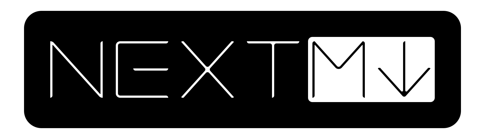

<div align="center">
  


Next-Gen Markdown
  
</div>


<br/><br/><br/>

**WORK IN PROGRESS**

Sample:

```md
@use 'https://some-url/templates/something.md'

@import 'https://some-server/some-style.css'
@from 'https://some-other-server/cool-btn.jsx' import { CoolButton }
@from './data.yml' import { user }


# Hellow {{ user.name }}

This is the magic of next mark!

<CoolButton link="{{ user.url }}">
  Visit **{{user.name}}**'s profile
</CoolButton>
```
